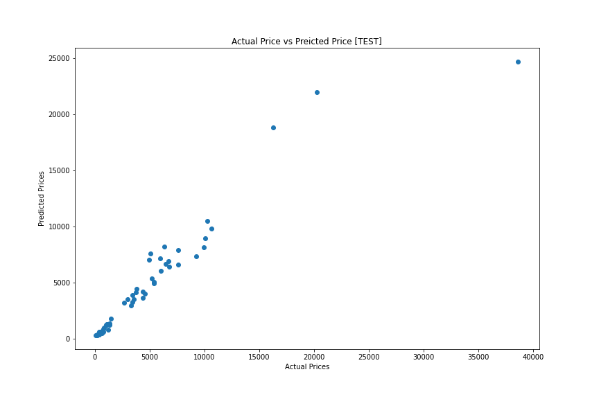

# 🚘 Car Price Prediction: Project Overview 
* End to end project reasearching the effects certain attributes have on the value of a car
* Optimised Random Forest Regressor using RandomizedSearchCV to reach the best model
* Built a client facing API using flask 
* Deployed Model in using Heroku for wider use 

[View Deployed Model](https://carsalepricecalc.herokuapp.com/)

## Table of Contents 
[Resources](#resources)<br>
[Data Collection](#DataCollection)<br>
[Data Pre-processing](#DataPre-processing)<br>
[Data Warehousing](#DataWarehousing)<br>
[Exploratory data analysis](#EDA)<br>
[Data Visualisation & Analytics](#Dataviz)<br>
<!-- [Business Intelligence](#Busintelli)<br> -->
[Feature Engineering](#FeatEng)<br>
[ML/DL Model Building](#ModelBuild)<br>
<!-- [Model performance](#ModelPerf)<br> -->
[Model Optimisation](#ModelOpt)<br>
[Model Evaluation](#ModelEval)<br>
[Deployment](#ModelDeploy)<br>
[Project Management (Agile | Scrum)](#Prjmanage)<br>
[Project Evaluation](#PrjEval)<br>
[Looking Ahead](#Lookahead)<br>
[Questions | Contact me ](#Lookahead)<br>


<a name="Resources"></a>  

## Resources Used
**Python 3, PostgreSQL, SQL, Tableau, Heroku** 

[**Anaconda Packages:**](requirements.txt) **pandas numpy pandas_profiling ipywidgets sklearn matplotlib seaborn sqlalchemy kaggle psycopg2 ipykernel**<br><br>
Powershell command for installing anaconda packages used for this project    
```powershell
pip install pandas numpy pandas_profiling ipywidgets sklearn matplotlib seaborn sqlalchemy kaggle psycopg2 ipykernel
```

<a name="DataCollection"></a>  

## [Data Collection](Code/P8_Code.ipynb)
Powershell command for data import using kaggle API <br>
```powershell
!kaggle datasets download -d nehalbirla/vehicle-dataset-from-cardekho -p ..\Data --unzip 
```
[Data source link](https://www.kaggle.com/nehalbirla/vehicle-dataset-from-cardekho)
[Data](Data/car data.csv)
*  Rows: 301 | Columns: 9
    *	Year	
    *   Selling_Price	
    *   Present_Price	
    *   Kms_Driven	
    *   Fuel_Type	
    *   Seller_Type	
    *   Transmission	
    *   Owner
3
 

<a name="DataPre-processing"></a>  

## [Data Pre-processing](Code/joining_data.sql)
After I had all the data I needed, I needed to check it was ready for exploration and later modelling. I made the following changes and created the following variables:   
*   General NULL and data validity checks  
*   Web-scraped conversion data for the correpeonding years for Rupees to GBP. 
*   Used SQL to join this data and apply hte conversions respectivly 
    *   I created substitute columns from Lakhs to GBP and used those instead 

<a name="DataWarehousing"></a>

## [Data Warehousing](Code/P6_Code.ipynb)
I warehouse all data in a Postgre database for later use and reference.

*   ETL in python to PostgreSQL Database.
*   Formatted column headers to SQL compatibility. 

<a name="EDA"></a>  

## [Exploratory data analysis](Code/P6_Code.ipynb) 
I looked at the distributions of the data and the value counts for the various categorical variables that would be fed into the model. Below are a few highlights from the analysis.
*   More than 70% of cars were bought brand new. 
*   There are over 5 times more manual cars than automatic cars in the data 


*   The distribution plot shows the distribution of numeric columns 


*   The features are not strongly correlated generally. 
*   The kms_driven are inversly correlated to the year of sale, which makes sense becasue older cars are more likely to have driven further than those with a more recent year (larger year)


<a name="Dataviz"></a>  

## [Data Visualisation & Analytics](https://public.tableau.com/app/profile/mattithyahu/viz/P8CarPriceAnalysis/Dashboard?publish=yes)
[View Interactive Dashboard](https://public.tableau.com/app/profile/mattithyahu/viz/P8CarPriceAnalysis/Dashboard?publish=yes)
*   I created an interactive dashboard to interactively analyse the reltionships between features.


<!-- <a name="Busintelli"></a>  

## Business Intelligence
On Page 2 of the interactive dashboard, I have provided the stake holders with the new customer names and the customers that are likely to churn due to their characteristics.

*   These customers can be offered subsidised deals and incentives to keep them on
*   Greater engagement with customers could keep some customers on board 
*   Providing quality customer service can also provide customers with long term value and appreciation for the business
*   The complaints team should pay particular attention to complaints from customers who are predicted to churn.
- 96% of unhappy customers don’t complain and 91% of those will simply leave and never come back? -->

<a name="FeatEng"></a>  

## [Feature Engineering](Code/P6_Code.ipynb) 
I transformed the categorical variables 'fuel_type', 'seller_type', and 'transmission' into dummy variables. I also split the data into train and tests sets with a test size of 20%.
*   One Hot encoding to encode values
  

<a name="ModelBuild"></a> 

## [ML/DL Model Building](Code/P6_Code.ipynb)

I used the RandomForestRegressor becasue of its perfomative benefits . RFRs have some key advantages that make them most suitable for certain problems and situations:
*   It automates missing values present in the data
*   Normalising of data is not required as it uses a rule-based approach

<!--  -->
<!-- 
<a name="ModelPerf"></a> 

## [Model performance](Code/P6_Code.ipynb)
*   **RandomForestRegressor** : Accuracy = 84.45%  -->

<a name="ModelOpt"></a> 

## [Model Optimisation](Code/P8_Code.ipynb)
In this step, I used RandomizedSearchCV to find the best parameters to optimise the performance of the model. 

```python
# Setup random hyperparameter search for LogisticRegression
regressor = RandomizedSearchCV(estimator = regressor, param_distributions = random_grid,scoring='neg_mean_squared_error', n_iter = 10, cv = 5, verbose=2, random_state=42, n_jobs = 1)

# Training model on training data byy fitting it with train data
regressor.fit(X_train, y_train)
```


<a name="ModelEval"></a> 

## [Model Evaluation](Code/P6_Code.ipynb)
*   I used the r2_score to see the error associated with the model. But because it is a regression use case, I can’t give an accuracy score. 
An R-Squared value above 0.7 would generally be seen as showing a high level of correlation. The model achieved a R2 value of 0.828.
A value of 0.5 means that half of the variance in the outcome variable is explained by the model.

*   Plotting the actual and predicted values for botht the training and test sets shows how accracy and linear correlation decreases only slightly in the test data. 



 

<a name="ModelProd"></a> 

## [Model Productionisation](app.py)
I built a flask REST API endpoint that was hosted on a local webserver before Heroku deployment. The API endpoint takes in request values and returns prediction of diabetes diagnosis. I also optimised and formatted the frontend using HTML and CSS. 

<a name="ModelDeploy"></a> 

## [Deployment](https://carsalepricecalc.herokuapp.com/)
The end point was deployed using the Heroku cloud platform. Click above to use it!  

<a name="Prjmanage"></a> 

## [Project Management (Agile | Scrum)](https://www.atlassian.com/software/jira)
* Resources used
    * Jira
    * Confluence
    * Trello 

<a name="PrjEval"></a> 

## [Project Evaluation]() 
*   WWW
    *   The end-to-end process
    *   Use larger data 
    *   Use data tailored to european cars 
*   EBI 
    *   Frontend Tuning
    *   Try other algorithms 

<a name="Lookahead"></a> 

## Looking Ahead
*   What next
*   Can this be used on something like WeBuyanycar.com?? 

<a name="Questions"></a> 

## Questions | Contact me 
For questions, feedback, and contribution requests contact me
* ### [Click here to email me](mailto:theanalyticsolutions@gmail.com) 
* ### [See more projects here](https://github.com/MattithyahuData?tab=repositories)


